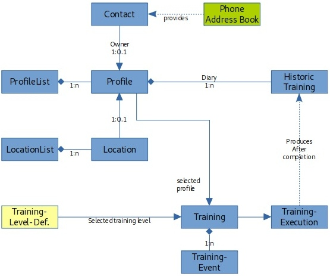

# haller-flf-training-app

Four-Legged-Friends: Equikinetic Trainings App for mobile devices

## Architecture
### Data Model

## Technology
- [flutter](https://flutter.dev/)

## Resources
### Code Structure

- [Scalable app structure in flutter](https://hackernoon.com/scalable-app-structure-in-flutter-dad61a4bc389)
- [Flutter: Code Organization](https://medium.com/flutter-community/flutter-code-organization-de3a4c219149)
- [Flutter: Scalable app structure](https://medium.com/@parthibansudhaman/flutter-scalable-app-folder-structure-6f2b0bc139c4)
- [Flutter Architecture Samples](https://fluttersamples.com/)

### Flutter
- [Lab: Write your first Flutter app](https://flutter.dev/docs/get-started/codelab)
- [Cookbook: Useful Flutter samples](https://flutter.dev/docs/cookbook)
For help getting started with Flutter, view our [online documentation](https://flutter.dev/docs), which offers tutorials,
samples, guidance on mobile development, and a full API reference.
### User Interface: Navigation
- [BottomNavigationBar and Routes](https://medium.com/flutter/getting-to-the-bottom-of-navigation-in-flutter-b3e440b9386)
- [Bottom Navigate Like the Pros in Flutter](https://medium.com/swlh/bottom-navigate-like-the-pros-in-flutter-8a48bdd5fed4)

### Dart
- [Effective Dart: Style](https://dart.dev/guides/language/effective-dart/style)